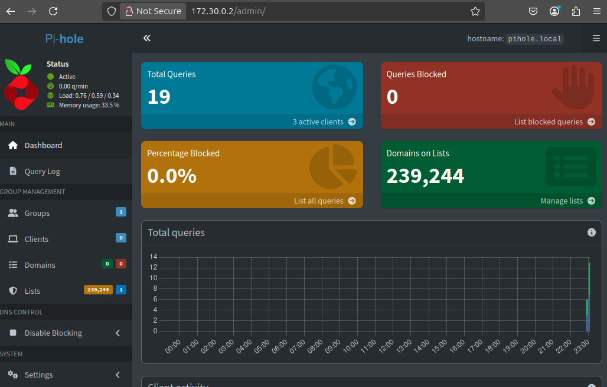

# Pihole_lab

### ¿Qué hace Pi-hole?
-    ### En lugar de que los dispositivos en tu red consulten directamente servidores DNS como Google (8.8.8.8) o Cloudflare (1.1.1.1), las solicitudes DNS pasan primero por Pi-hole.
-    ### Si la solicitud es hacia un dominio conocido por contener publicidad o malware, Pi-hole la bloquea.
-    ### Si es legítima, resuelve normalmente (consulta un servidor DNS externo como 1.1.1.1 o 9.9.9.9).

### Ventajas
-    ### Ligero (corre en Raspberry Pi, contenedor Docker, etc.)
-    ### Protege todos los dispositivos de la red
-    ### Tiene estadísticas y gráficos útiles
-    ### Completamente gratuito y de código abierto


# Instalacion
### La instalacion y despliegue de el laboratorio se dio desde docker.
### Los contenedores son una opcion liviana y agil para el laboratorio, permitiendo recrear todas las capacidades necesarias.

## Creacion de la red.
### Se desplego una red interna en docker, aclarando el apartado bridge para tener acceso a internet, y, creando un nuevo rango de ip para las maquinas.

```bash
    #new network
    docker network create \
      --driver=bridge \
      --subnet=172.30.0.0/16 \
      pi-net
```

## Pi-hole.

```bash
    docker run -d \
      --name pihole \
      --net pi-net \
      --ip 172.30.0.2 \
      -e TZ="America/Santo_Domingo" \
      -e WEBPASSWORD="admin123" \
      -e DNSMASQ_LISTENING=all \
      -e FTLCONF_LOCAL_IPV4=172.30.0.2 \
      -e VIRTUAL_HOST="pihole.local" \
      -p 8080:80 \
      -p 53:53/tcp \
      -p 53:53/udp \
      --cap-add=NET_ADMIN \
      --restart=unless-stopped \
      pihole/pihole:latest
```

## kali.

```bash
    docker run -d \
      --name kali_machine \
      --network pi-net \
      kalilinux/kali-rolling \
      /bin/bash
```

# Bloqueo de un dominio.
### El laboratorio consiste en usar pihole como dns de kali, para interceptar y manipular las peticiones hechas desde el contenedor de kali.


### Luego de desplegar los contenedores se accede a la interfaz de pihole desde el navegador para administrar todo.
### (En caso de fallar la clave de acceso se puede usar el comando docker exec -it pihole /bin/bash -c "pihole -a -p\" desde la terminal para setear una nueva clave.)

```bash
    docker exec -it pihole /bin/bash -c ”pihole -a -p"
```




### En el area de Query log se pueden ver todas las peticiones que hacen las maquinas.
### Presionando el boton Deny se puede bloquear la peticion y crear una especie de regla que blockea este dominio en todas las paginas.


### En el area de Domains se puede ver el dominio que se acaba de agregar, pudiendo agregar un grupo asignado, comentario y tipo ( permitiendo bloquearlo, aceptarlo, etc. ).


### Al haber usado curl en la maquina se ve un codigo 301 (codigo que redirecciona a otra pagina) pero ya bloqueando la direccion en pihole no se recibe ningun mensaje desde la terminal.


